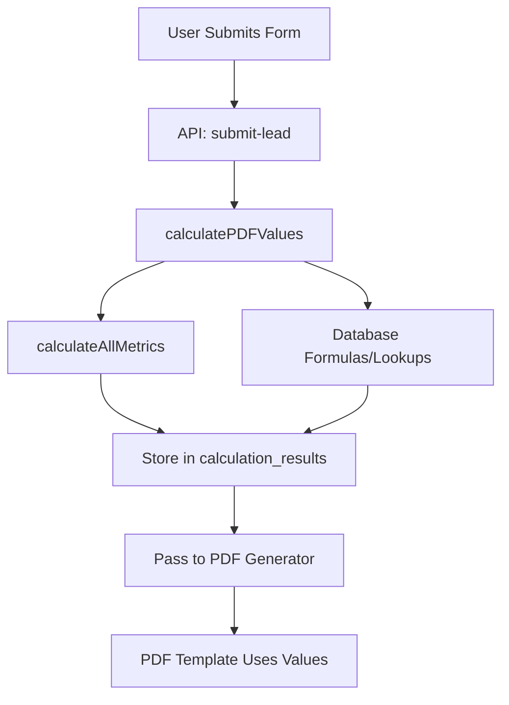

# Calculation Flow Documentation

## Overview
This document shows exactly what calculations are performed and where they happen in the E1 Calculator system.

## 📍 Where Calculations Happen

### 1. **Form Submission** (`/api/submit-lead/route.ts`)
When a user submits the form, the following happens:

```typescript
// Line 101: Calculate PDF values
const calculationResults = await calculatePDFValues(formData, body.sessionId);
```

### 2. **PDF Calculation Service** (`src/lib/pdf-calculations.ts`)
This service:
- Extracts shortcodes from PDF templates
- Runs calculations using two methods:
  1. **Comprehensive calculations** from `calculation-definitions.ts`
  2. **Database formulas** via the unified calculation engine

### 3. **Calculation Definitions** (`src/lib/calculation-definitions.ts`)
Contains all the actual calculation logic and formulas.

## 📊 What Gets Calculated

### Energy Metrics
| Metric | Formula | Unit |
|--------|---------|------|
| **Annual Energy Need** | `neliot * 100 * (huonekorkeus / 2.5) * building_age_factor * hot_water_factor` | kWh/year |
| **Heat Pump Consumption** | `annual_energy_need / 3.3` (COP = 3.3) | kWh/year |
| **Heat Pump Annual Cost** | `heat_pump_consumption * 0.12` | €/year |

### Cost Calculations
| Metric | Formula | Unit |
|--------|---------|------|
| **Current Heating Cost** | From lookup `[lookup:menekin-hinta]` or calculated based on heating type | €/year |
| **Annual Savings** | `current_heating_cost - heat_pump_annual_cost` | €/year |
| **Monthly Savings** | `annual_savings / 12` | €/month |
| **5-Year Savings** | `annual_savings * 5` | € |
| **10-Year Savings** | `annual_savings * 10` | € |

### Financial Metrics
| Metric | Formula | Unit |
|--------|---------|------|
| **Payback Period** | `15000 / annual_savings` | years |
| **ROI (10 years)** | `((ten_year_savings - 15000) / 15000) * 100` | % |

### Environmental Metrics
| Metric | Formula | Unit |
|--------|---------|------|
| **CO2 Reduction (Oil)** | `oil_consumption * 2.66 - heat_pump_consumption * 0.181` | kg CO2/year |
| **CO2 Reduction (Electric)** | `(current_consumption - heat_pump_consumption) * 0.181` | kg CO2/year |
| **Efficiency Improvement** | `((current_consumption - heat_pump_consumption) / current_consumption) * 100` | % |

## 🔧 Adjustment Factors

### Building Age Factor
- Before 1960: 1.3
- 1960-1979: 1.2
- 1980-1999: 1.1
- 2000-2009: 1.0
- After 2010: 0.9

### Hot Water Usage Factor
- 1-2 persons: 0.9
- 3-4 persons: 1.0
- 5+ persons: 1.15

## 📋 Required Form Fields

These fields must be present in `form_data` for calculations:

- `neliot` - Property size in m²
- `huonekorkeus` - Ceiling height (default: 2.5m)
- `rakennusvuosi` - Building year
- `henkilomaara` - Number of residents
- `lammitysmuoto` - Current heating type
- `kokonaismenekki` - Current consumption (from lookup)
- `menekinhintavuosi` - Current annual cost (from lookup)

## 🔄 Calculation Flow



## 📝 Stored Results

The `calculation_results` JSONB column contains:

```json
{
  "annual_energy_need": 14256,
  "heat_pump_consumption": 4320,
  "heat_pump_cost_annual": 518,
  "current_heating_cost": 2600,
  "annual_savings": 2082,
  "five_year_savings": 10410,
  "ten_year_savings": 20820,
  "monthly_savings": 174,
  "payback_period": 7.2,
  "return_on_investment": 39,
  "co2_reduction": 4538,
  "efficiency_improvement": 78
}
```

## 🎯 PDF Template Access

The PDF template (`SavingsReportPDF.tsx`) accesses these values via the `data` object:

- `data.annual_savings` → Annual savings in €
- `data.heat_pump_consumption` → Heat pump electricity consumption
- `data.five_year_savings` → 5-year total savings
- `data.ten_year_savings` → 10-year total savings
- `data.payback_period` → Years to pay back installation
- `data.co2_reduction` → CO2 reduction per year

## 🚀 Adding New Calculations

To add a new calculation:

1. **Define the formula** in `src/lib/calculation-definitions.ts`
2. **Add to calculateAllMetrics()** function
3. **Include in CalculationResults** interface in `src/lib/supabase.ts`
4. **Use in PDF template** as `data.your_new_metric`

## 📊 Testing Calculations

Run the test script to verify calculations:

```bash
npx tsx scripts/test-calculations.ts
```

This will show all calculations with test data and validate the results.